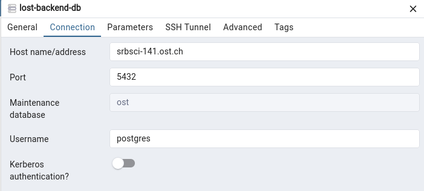

# Backend

- Ubuntu 24.04.2 LTS
- Hostname: srbsci-141.ost.ch
- IP: 10.8.36.141/23
- DNS: 130.59.31.251(primary)/130.59.31.248
- all ports are open
- 2 vCPU, RAM 4096 MB, Drive 50 GB
- End of life: 2025-10-31 (automatically deleted after this date)
- Support: <sgi-support@ost.ch>

## Connect to Ubuntu server

1. Connect to OST VPN.
2. `ssh -i ~/.ssh/id_ed25519 ins@srbsci-141.ost.ch`

The SSH keys of all our team members were added to the server.

## Connect to DB

OST VPN connection required! Any application that can make connections to a postgres database should work. For example [pgadmin4](https://www.pgadmin.org/download/).

- Hostname: `srbsci-141.ost.ch`
- Port: `5432`
- Database: `ost`
- Username: `postgres`
- Password: ask Roman



## Server setup

This is the server setup part, which is only needed in case the server needs to be reinstalled!

### Authorized keys

[SSH keys](https://ostch-my.sharepoint.com/:t:/r/personal/leo_oetterli_ost_ch/Documents/Bachelor_Inf_Sem6/SE-Project/Server/authorized_keys.txt?csf=1&web=1&e=AtQha6) were added to ./ssh/authorized_keys.

### Docker installation

Docker was installed using the apt repository and as shown in [this guide](https://docs.docker.com/engine/install/ubuntu/#install-using-the-repository).

#### Add user to docker group

The INS user needs to be added to the docker group, otherwise a permission denied error appears when using docker run. Refer [to this guide](https://docs.docker.com/engine/install/linux-postinstall/#manage-docker-as-a-non-root-user) for more details. The commands are the following:

```terminal
sudo groupadd docker
sudo usermod -aG docker $USER
newgrp docker # applies group changes
docker run hello-world # confirms the successful installation.
```

### Clone backend repository

1. A new SSH key called `backend-SSH-key` was created on the server (no passphrase).
2. The SSK key was added as a deploy-key (read/write) in the backend repository. [Link to guide](https://docs.github.com/en/authentication/connecting-to-github-with-ssh/managing-deploy-keys#deploy-keys).
3. `~/.ssh/config` created to use correct SSH key.

    ```text
    Host github.com
        User git
        IdentityFile ~/.ssh/backend-SSH-key
        IdentitiesOnly yes
    ```

